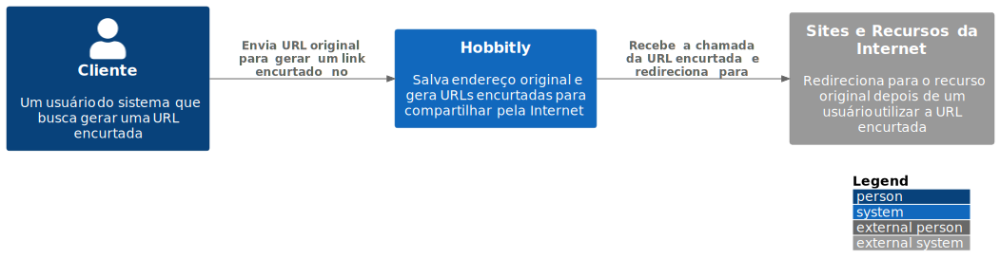
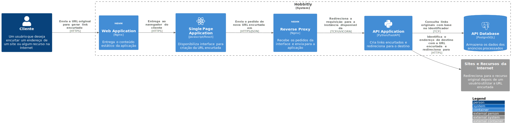

# Hobbitly - Encurtador de URLs

Esse projeto foi pensado para colocar em prática o desenvolvimento de um sistema web, e que de acordo com a demanda dos usuários, sua arquitetura
vai evoluindo com o tempo, implementando novos procedimentos, boas práticas e tecnologias utilizadas em cases de alta demanda.

## O que é um encurtador de URLs?

Na Internet lidamos com os links e as conhecidas URLs, que é o endereço no qual identifica em qual site desejamos acessar. Nos deparamos
com inúmeros links e de vários tipos, nos chats, sites e até em conteúdos impressos. Dentre elas, acabamos nos deparando com endereços
tão grandes que é complicado de decorar, e até mesmo para mandar para alguém, já que o textão que você mandou para alguém, no final das contas
é uma "sopa de letrinhas".

Com isso em mente, foi-se pensado em um meio de criar novos links que apontassem para o mesmo destino (um site, imagem, etc), mas agora com um
tamanho bem menor, e mais prático para compartilhar de forma curta e simples.

Essa aplicação começou principalmente com advendo do Twitter, em que 
por conta da limitação dos 140 caracteres, a rede social começou a seguir essa estratégia para que o usuário possa ter mais espaço possível para o
seu Tweet.

Abaixo, alguns outros exemplos do porque criar essas URLs:

- Encurtar URLs para que se encaixem melhor em uma página da web ou para serem copiadas manualmente, se alguém ainda fizer isso.
- Rastreamento de tráfego para realizar análises de quem visita suas páginas por meio do encurtador de URL.

### Como funciona um encurtador de URLs?

O que um sistema que encurta URLs espera dele é que efetue o seguinte:

1. Que ofereça uma interface para que o usuário possa enviar a URL original que será encurtada
2. O sistema irá armazená-la, e gerar um identificador único relacionado ao endereço
3. O sistema vai retornar a URL encurtada, que normalmente segue alguns desses formatos:
    - https://hobbit.ly/1h0Ahbz
    - https://hobbit.ly/?id=1h0Ahbz
    - https://hobbit.ly/?id=10212
4. Com esse novo link, quando o usuário irá utilizá-lo, o sistema vai reconhecer o identificador, e com isso
o usuário será redirecionado para o destino, representado pela URL original.

## Tecnologias utilizadas

O sistema é desenvolvido com as seguintes ferramentas:

- Python 3.9
- React
- FastAPI
- SQL Model
- Alembic
- PostgreSQL

